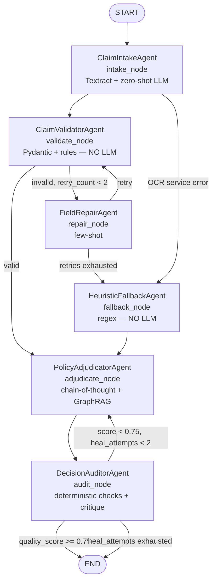
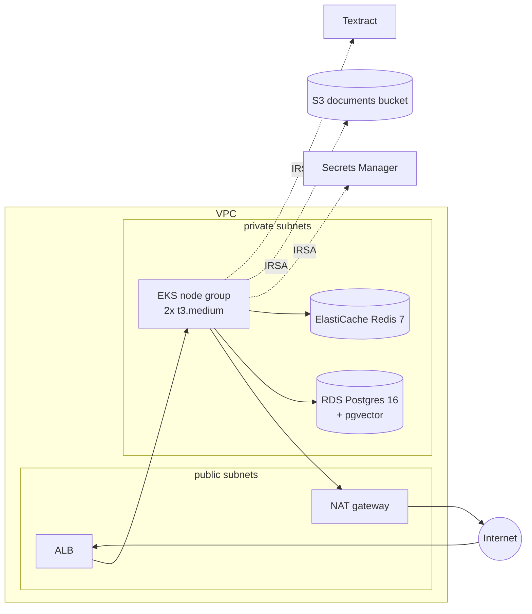

# Architecture

## The graph

Six named agents, two of which never call a model — `ClaimValidatorAgent` and
`HeuristicFallbackAgent` are deterministic on purpose. The retry loop
(`repair_node → validate_node`) and the heal loop (`audit_node → adjudicate_node`) are both
bounded by counters carried in `ClaimState` (`retry_count`, `heal_attempts`), not by
LangGraph's recursion limit — the state is what stops the loop, so the stopping condition is
visible and testable.

## Retrieval — GraphRAG over networkx, fused with pgvector

`PolicyAdjudicatorAgent` retrieves two things concurrently (`asyncio.gather`) for every
claim:

- **Graph traversal** (`rag/graph_store.py`): `nx.ego_graph` from each procedure/diagnosis
  code plus the constant `POLICY` node (where co-pay and network-reduction conditions
  attach), radius = 2 hops normally, widened to 3 on a heal loop. Serialised as readable
  triples, each carrying a `clause_id` — that's what makes citations checkable.
- **Vector search** (`rag/pgvector_store.py` / `rag/numpy_store.py`): cosine top-k over
  policy chunks embedded with `text-embedding-3-small`.

The two legs are merged, deduped and truncated to a token budget (`memory/policy.py`,
`config/tradeoff.yaml`) before they ever reach the chain-of-thought prompt. This is why
`GET /v1/graph/subgraph?codes=CPT-99213&hops=2` exists as a standalone endpoint — it lets you
see exactly what the agent retrieved, independent of what the LLM did with it.

## Self-healing

`DecisionAuditorAgent` runs cheap deterministic checks first (every cited clause resolves in
`retrieved_context`, the arithmetic balances, no required field is null, a `DENY` cites an
exclusion or waiting-period clause when it has any citations at all — an empty-citation `DENY`
is structural ineligibility, e.g. the service date falls outside the policy period, and has
nothing to cite). Only then does one LLM critique call run, scored 0.0–1.0. A failed
deterministic check caps the score at 0.5 before the LLM sees it. Below the 0.75 threshold and
under the heal-attempt cap, the critique is written back into state and the graph loops to
`adjudicate_node`, which widens graph retrieval when the critique says evidence was missing.

## Context vs. history vs. memory

Three budgets, each with a different lifetime, tracked separately so the tradeoff is visible
rather than implicit:

- **Context** — evidence retrieved for *this* call. Rebuilt fresh every time.
- **History** — messages within *this* graph run (a repair retry, a heal loop). Windowed,
  older turns rolled into a summary.
- **Memory** — durable facts across runs, in a `long_term_memory` table (SQLite locally,
  Postgres on AWS), scoped by `member_id`/`policy_no`, TTL 90 days. This is what lets
  `CLM-010` (an exact duplicate of `CLM-001`) get flagged as a likely duplicate instead of
  silently re-approved.

`memory/policy.py::assemble_prompt_payload` is the one function every LLM-calling agent goes
through — it enforces the three budgets with `tiktoken`, truncating in priority order
memory → history → context (the evidence for the current step is sacrificed last), and emits
`context_tokens_used{agent,bucket}` so the tradeoff shows up on the Grafana dashboard.
`scripts/tradeoff_demo.py` runs one claim at three budget profiles side by side.

## Runtime profiles

`APP_ENV` is the single switch (`src/app/core/settings.py`); everything else derives from it.

| Service | `local` | `aws` |
|---|---|---|
| OCR | `FixtureOCRProvider` (pre-saved Textract JSON) | `TextractOCRProvider` |
| Cache | `InMemoryCache` | `RedisCache` on ElastiCache |
| Vector store | `PgVectorStore` (Docker) or `NumpyVectorStore` | `PgVectorStore` on RDS |
| Checkpointer | `AsyncSqliteSaver` (`./.local/checkpoints.sqlite`) | `AsyncPostgresSaver` on RDS |
| Secrets | `.env` | AWS Secrets Manager via IRSA |
| Object storage | `./data/documents/` | S3 |

`boto3` and `redis` are imported lazily, only inside the `aws` implementation of each
Protocol — a local run never needs either package importable, let alone installed as more
than a dependency-closure entry.

## Deployment topology (AWS)

One NAT gateway, not two — a documented cost tradeoff for a learning deployment (see
`infra/terraform/modules/network`). Pod → AWS service auth is IRSA throughout: no static AWS
access keys are ever baked into the container or the cluster.

## Repository map

See **Repository Structure** in [docs/DEVELOPMENT_PLAN.md](DEVELOPMENT_PLAN.md) for the
complete, authoritative file-by-file layout this codebase follows exactly.
